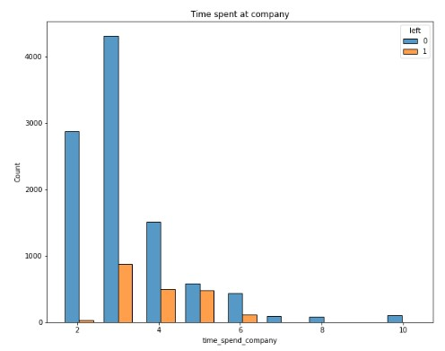
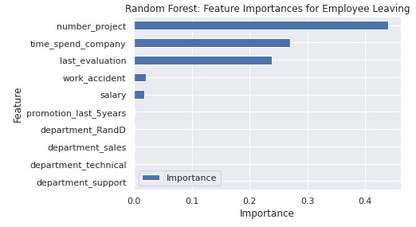
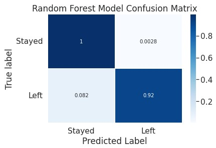

Google Advanced Data Analytics Capstone Project Salifort Motors
================
2023-08-23

Providing data-driven suggestions for HR

**Overview**

The goal of this project was to create an effective model for predicting employee departure from Salifort Motors (a fictional company of over 100,000 employees). The scenario was that there has been concern over the high turnover rate among employees and HR conducted a survey to learn more about what might be causing this. A logistic regression and random forest model were created for this project. The logistic regression model predicted an employee leaving the company with 81.9% accuracy and 44% precision, while the final random forest model performed with 95.3% accuracy and 90.7% precision, so the random forest model outperformed the logistic regression model. Based on the random forest model, the number of projects and employee had, the amount of time they spent at the company, and their last evaluation score were the most influential variables (of the ones used) in determining whether an employee would leave.

**Data Understanding**

This project used data from [Hr Analytics Job Predection](https://www.kaggle.com/datasets/mfaisalqureshi/hr-analytics-and-job-prediction?select=HR_comma_sep.csv). The data consists of 14999 rows of employee data (11991 after duplicates were removed) and 10 features. The features include information about employee satisfaction level, last evauation score, number of projects, average monthly hours worked, time spent at company, whether the employee had a work accident, whether the employee left the company, if the employee had been promoted within the last 5 years, the department the employee is in, and the salary (low, medium, or high) that the employee made. The bar chart below shows the distribution of employees by time spent at the company, colored by if they left.

**Modeling and Evaluation**

The final random forest model performed with 95% accuracy, 91% precision, 80% recall, 0.85 F1 score, and 0.89 ROC AUC score. Outliers for time spent at company were removed and the columns for satisfaction level and average hours worked per month were removed due to concerns with data leakage. The bar chart below shows the most important features used in the model to predict whether the employee would leave.

The chart below is the confusion matrix for the random forest model. We can see that the model correctly predicts many True Negatives and True Positives.

**Conclusion**

The Random Forest Model performed the best at predicting whether an employee will leave the company. This was based on variables including their department, last evaluation score, number of projects, time spent at company, promotion within last 5 years, and salary. Based on the analysis and the model, the data indicates that employees leave due to being overworked and not compensated enough for this, leading to them being unsatisfied. The model is useful to predict whether an employee will leave and gives insight into what causes this, which leadership can use to improve employee retention. There are other factors that could be further analyzed for employee retention, such as through predicting satisfaction levels. Some recommendations to increase employee retention are:

- Giving employees an amount of work and projects that they can handle. The company can have managers do checks with employees to see if they are feeling overworked or underworked. It seems employees are unsatisfied when they have too little or too much to handle.
- Find out why employees at the 2-4 year marks are unsatisfied. This could be because of low pay and lack of promotions even after years spent at the company.
- Employees that left the company didn't differ much by department. If changes are implemented, it should be implemented company-wide.
- Reevaluate how evaluation scores are made because it may affect employee morale if employees are expected to work 200+ hours to have high evaluation scores.
- Many employees in the dataset are working more than a typical average amount of hours should be for a month, so this could be something that managers discuss with their teams and check in with employees on more frequently.

Next steps:

- It could be valuable to have an anonymous survey that employees could fill out on what they think the company could improve on and what they currently like about the company. These insights could be used to further analyze employee satisfaction.
- Employee satisfaction, as expected, seems to be closely tied to an employee leaving. It could be helpful to further analyze employee satisfaction and predict whether an employee is satisfied.
